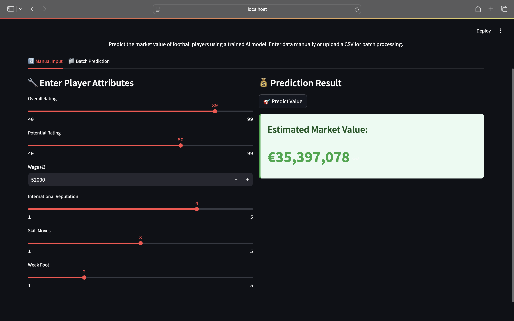
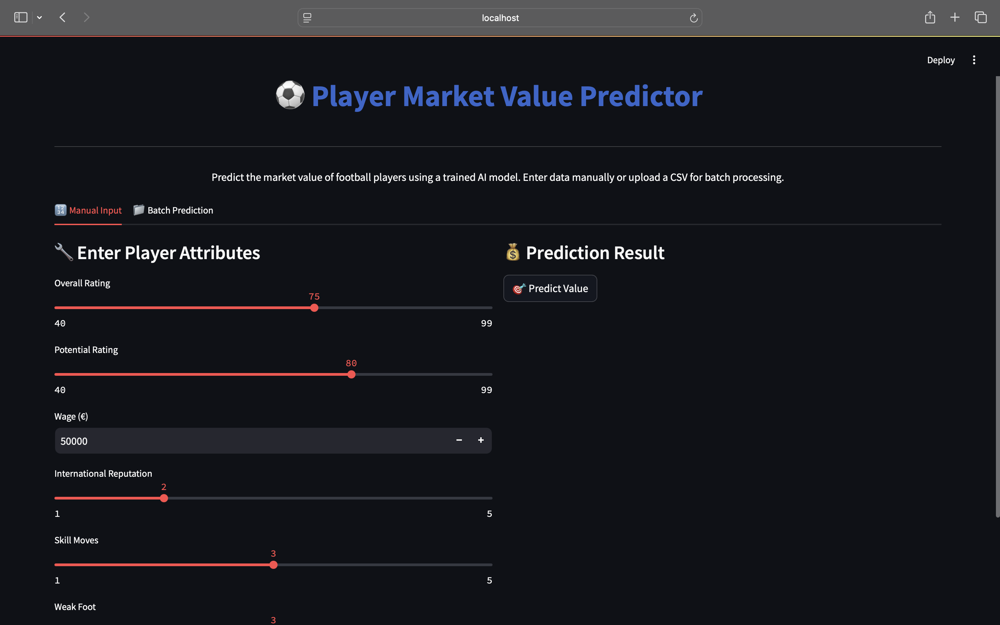

# ⚽ Football Player Market Value Estimator

An interactive AI-powered Streamlit app that predicts the market value of football players based on their attributes. It uses an XGBoost model trained on player statistics, including skill, physical traits, and reputation.

---

## 🚀 Features

- **🔢 Manual Input**: Enter individual player stats and predict market value with radar and bar chart visualizations.
- **📁 Batch Upload**: Upload a CSV file with multiple players for bulk prediction.
- **🔍 Search**: Look up existing player predictions using smart, case-insensitive search.
- **📊 EDA Report**: Full EDA report (HTML) embedded in the app for insights on data distribution, correlation, and trends.

---

## 📂 Project Structure

```
Football Player Value Prediction/
│
├── data/
│   ├── FootballPlayerRawDataset.csv
│   ├── sample_batch_players.csv
│   
├── notebooks/
│   ├── eda_report.html              # Rendered EDA report
│   ├── Football_EDA.ipynb           # Jupyter notebook for EDA
│   └── improved_model.ipynb         # XGBoost modeling notebook
│
├── outputs/
│   └── PlayerValuePredictions.csv   # Predictions used for search
│
├── screenshots/
│   ├── home.png
│   └── manual_input.png
│
├── xgboost_app.py                   # Streamlit app
├── xgboost_model.pkl                # Trained XGBoost model
├── requirements.txt                 # Python dependencies
└── README.md
```

---

## 🧠 Model Details

- **Model**: XGBoost Regressor with log-transformed target (`log(value + 1)`)
- **MAE**: €121,934  
- **RMSE**: €576,539  
- **R² Score**: 0.9891 ✅

### 🔑 Key Features Used
- Numerical: `overall`, `potential`, `wage`, `age`, `height_cm`, `weight_kg`
- Categorical: `international_reputation`, `skill_moves`, `weak_foot`
- One-hot encoded: `position_*`

---

## ▶️ How to Run

1. **Install requirements**:
```bash
pip install -r requirements.txt
```

2. **Start the app**:
```bash
streamlit run xgboost_app.py
```

> Ensure the following files are present:  
> - `xgboost_model.pkl`  
> - `outputs/PlayerValuePredictions.csv`  
> - `notebooks/eda_report.html`

---

## 📥 Batch Upload Format

Include all trained features in your upload:

```csv
overall, potential, wage, international_reputation, skill_moves, weak_foot,
age, height_cm, weight_kg, position_CB, position_CM, ..., position_ST
```

---

## 📸 Screenshots

| Manual Input Tab | EDA Report Tab |
|------------------|----------------|
|  |  |

---

## 🙋‍♂️ Author

Crafted by Anish 
Powered by 🧠 Machine Learning + ⚽ Football